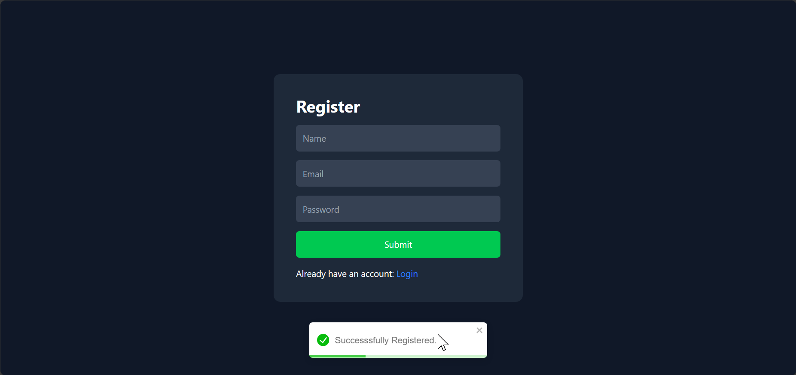
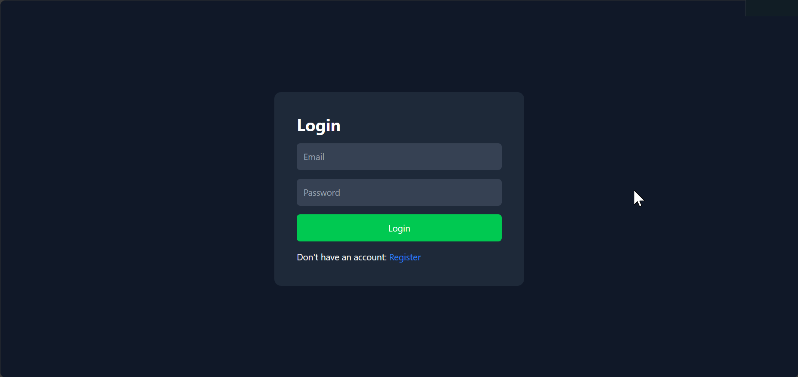
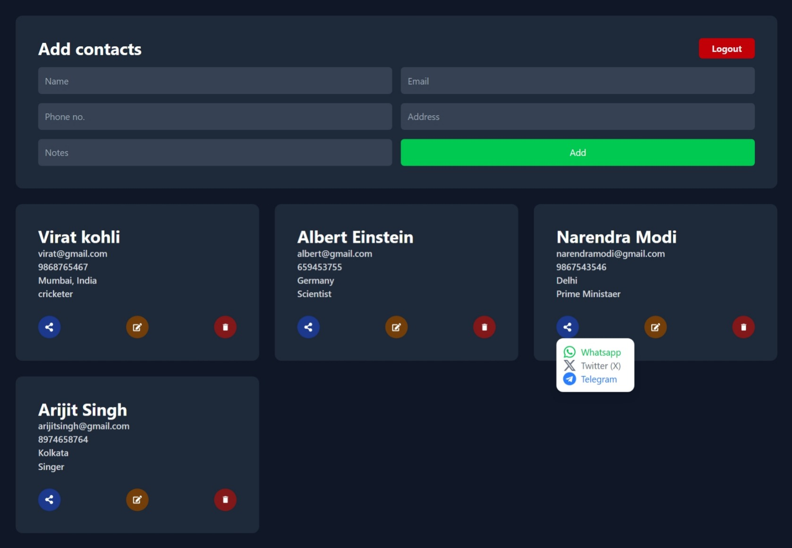

# 📣 ContactVault

**ContactVault** is a full-stack MERN (MongoDB, Express.js, React, Node.js) application that provides users with a secure platform to manage their private contact lists.User data is protected and accessible only to authorized users. Users can register, log in, and perform CRUD (Create, Read, Update, Delete) operations on their contacts, which include fields for name, phone number, and email address etc..

---

## 🚀 Features

- 📝 Users can log in to their account using their credentials.
- 📋 User dashboard to review all contact list.
- ⚡ Fast UI built with Tailwind CSS and Vite.
- 🔄 RESTful API using Express and MongoDB.
- ✅ Users can add, view, update, and delete their contacts.

---

## 🛠️ Tech Stack

### 🔷 Frontend

- **React** 
- **React Router DOM** 
- **Tailwind CSS**
- **Vite** 
- **Axios** 
- **react-icons** 
- **react-toastify** 

### 🔶 Backend

- **Node.js**
- **Express** 
- **MongoDB** + **Mongoose** 
- **dotenv** 
- **cors** 
- **nodemon**
- **bcryptjs**
- **cookie-parser**
- **jsonwebtoken**

---
## 🖼️ Screenshots

### Register Form

### User Login

### User Dashboard

